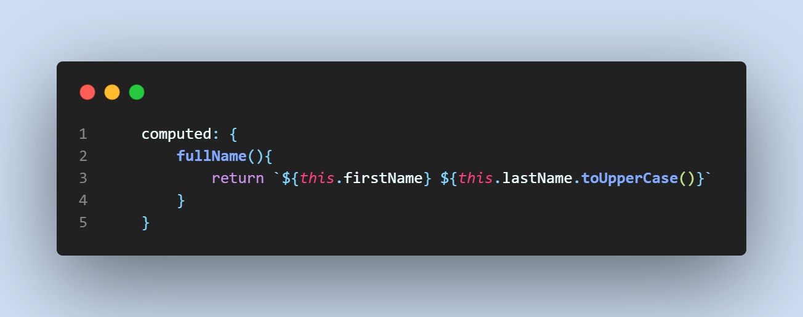

# Vue Scratchpad

## Quick Start

The starter code base will contain the following files:

```bash
- app.js
- index.html
- main.css
```


The Vue Javascript will instantiate a instance and the `data()` method returns shared data to the HTML.


## Data Access

Data attributes may be accessed and modified using methods.


A proxy getter/setter is provided by Vue and direct assignment is possible without referring to `data()`.


## Methods

Methods may be defined and used for evaluating complex expressions cleanly.


## Directives

Loading time of the HTML and the script may be different and the rendering may appear broken if the HTML loads first without the script.

All directives in Vue begin with `v-` prefix.

An example is the Cloak directive

The directive `v-cloak` may be used in the HTML as an attribute. Then, the CSS can hide the attribute until the script is ready.


Another directive is the Model directive, using the `v-model` directive in HTML.


The data is updated everywhere referenced when the `v-model` directive is used.

Finer control can also be achieved with the events handling on input received and varible binding.


## Events Listener

Events handling can be triggered by the `v-on` or `@` directive.


## v-model Modifiers

Some input modifiers can be used to limit or format user input.

For example:


Some modifiers include trim whitespace etc.

## Computed Properties

Computed properties are properties that are only updated when their component properties are updated.




## Watchers

Watchers perform additional tasks when a property is changed.


## Conditional Rendering vs `v-show`

Conditional rendering (`v-if`, `v-else-if`, `v-else`) renders only when the condition is true.

`v-show` however, the element is still there but only visible when condition true.

Use conditional rendering is cheap on load, but not cheap on toggling as re-rendering is needed often.

## Lifecycle Hooks

A lifecycle hook tells us how the webpage and script will be rendered.


There are four main events (8 main hooks) that you can utilize in your Vue app.

- Creation — runs on your component’s creation
- Mounting — runs when the DOM is mounted
- Updates — runs when reactive data is modified
- Destruction — runs right before your element is destroyed.

## Development Tools

### Vite

Vite is a useful project creation tool to configure projects for use.

```bash
npm create vite@latest
```

### Sass

Sass is a helpful tool to style webpages on top of CSS.

However, Sass cannot be directly used in Javascript, so it has to be compiled into CSS.

To install, use the command.

```bash
npm install sass
```

### PostCSS

PostCSS is also popular compared to SASS.

CSS is being compiled to PostCSS objects and the advantage is Javascript can be used to interact and modify the PostCSS object.

To install, use the command.

```bash
npm install autoprefixer --save-dev
```

A `postcss.config.cjs` file is required.

### ESLint

ESLint helps to lint code and autocomplete.

To install, use the command.

```bash
npm install eslint --save-dev
npm install vite-plugin-eslint --save-dev --force
```

Create a `vite.config.js` to use ESLint in Vite.

```javascript
import { defineConfig } from "Vite"
import eslint from "vite-plugin-eslint"
export default defineConfig ({
    plugins: [eslint()]
})
```

To use ESLint to fix, the `package.json` must look like this.

```json
{
  "name": "vite-project",
  "private": true,
  "version": "0.0.0",
  "type": "module",
  "scripts": {
    "dev": "vite",
    "build": "vite build",
    "preview": "vite preview",
    "lint": "eslint main.js --fix"
  },
  "devDependencies": {
    "autoprefixer": "^10.4.13",
    "eslint": "^8.30.0",
    "vite": "^4.0.0",
    "vite-plugin-eslint": "^1.8.1"
  },
  "dependencies": {
    "sass": "^1.57.1"
  }
}
```

To fix, run the command.

```bash
npm run lint
```
